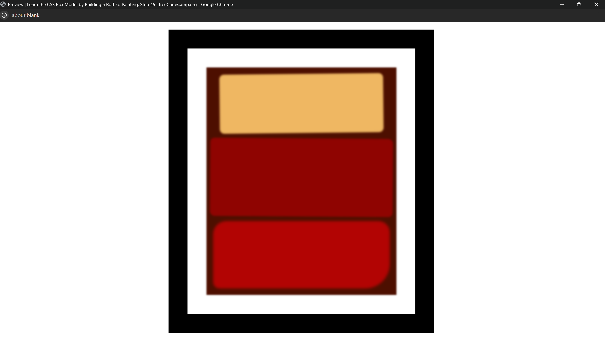

<h1>Project Title: Rothko Painting Webpage</h1>

This HTML and CSS code creates a webpage mimicking a Rothko painting, with colorful rectangular shapes arranged on a canvas within a frame.

<h2>Table of Contents</h2>
<ul>
    <li><a href="#introduction">Introduction</a></li>
    <li><a href="#project-structure">Project Structure</a></li>
    <li><a href="#features">Features</a></li>
    <li><a href="#getting-started">Getting Started</a>
        <ul>
            <li><a href="#prerequisites">Prerequisites</a></li>
            <li><a href="#installation">Installation</a></li>
        </ul>
    </li>
    <li><a href="#usage">Usage</a></li>
    <li><a href="#contributing">Contributing</a></li>
    <li><a href="#preview">Preview</a></li>
    <li><a href="#contact-information">Contact Information</a></li>
    <li><a href="#credits">Credits</a></li>
    <li><a href="#license">License</a></li>
</ul>

<section id="introduction">
    <h2>Introduction</h2>
    
This project consists of HTML and CSS files that together create a simple webpage resembling a Rothko painting. The painting is represented using colorful rectangular shapes arranged within a frame on a canvas.

</section>

<section id="project-structure">
    <h2>Project Structure</h2>
    
Files Included:

    <ul>
        <li>index.html: Contains the HTML structure for the webpage.</li>
        <li>styles.css: Contains the CSS styling for the webpage elements.</li>
    </ul>
</section>

<section id="features">
    <h2>Features</h2>
    
This project showcases basic styling techniques such as background colors, box shadows, border radius, and transforms.

</section>

<section id="getting-started">
    <h2>Getting Started</h2>
    <h3 id="prerequisites">Prerequisites</h3>
    
No prerequisites are needed to view the webpage.

<h3 id="installation">Installation</h3>
<ol>
    <li>Clone this repository to your local machine.</li>
    <li>Open the index.html file in a web browser.</li>
</ol>
</section>

<section id="usage">
    <h2>Usage</h2>
    
Explore the webpage to view the representation of the Rothko painting.

</section>

<section id="contributing">
    <h2>Contributing</h2>
    
Contributions to the project are welcome. Feel free to fork the repository and submit pull requests.

</section>

<section id="preview">
    <h2>Preview</h2>
    
 
</section>

<section id="contact-information">
    <h2>Contact Information</h2>
    
For any queries or feedback, you can reach out to me via:

    <ul>
        <li>LinkedIn ( www.linkedin.com/in/yashi-singh-b4143a246 ) </li>
        <li><a href="https://github.com/Yashi-Singh-1/">GitHub</a></li>
    </ul>
</section>

<section id="credits">
    <h2>Credits</h2>
    
Credit to FreeCodeCamp for the inspiration and learning resources. You can find the tutorial <a href="https://www.freecodecamp.org/learn/2022/responsive-web-design/learn-the-css-box-model-by-building-a-rothko-painting/step-1">here</a>.

</section>

<section id="license">
    <h2>License</h2>
    
This project is licensed under the <a href="https://github.com/Yashi-Singh-1/Rothko-Painting?tab=MIT-1-ov-file">MIT License</a>.

</section>
